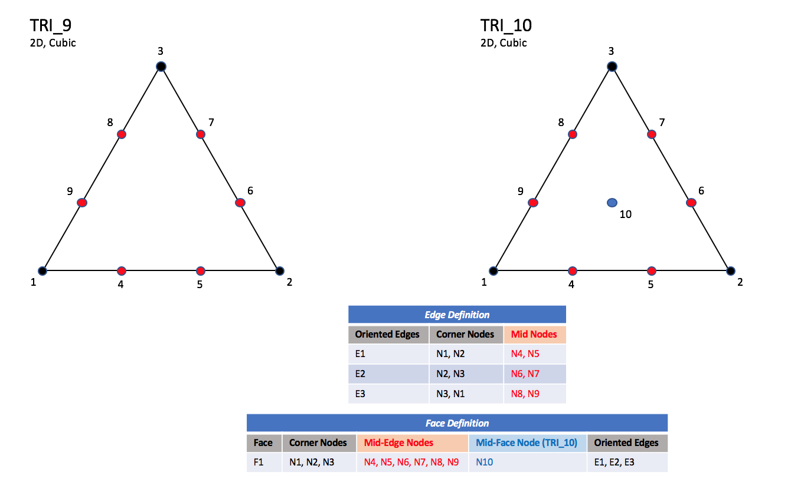

.. CGNS Documentation files
   See LICENSING/COPYRIGHT at root dir of this documentation sources

.. role:: sidskey(code)

.. role:: sidsref(code)

Conventions
-----------

Data Structure Notation Conventions
^^^^^^^^^^^^^^^^^^^^^^^^^^^^^^^^^^^

The intellectual content of the CGNS database is defined in terms of C-like notation including typedefs and structures. The database is made up of entities, and each entity has a type associated with it. Entities include such things as the dimensionality of the grid, an array of grid coordinates, or a zone that contains all the data associated with a given region. Entities are defined in terms of types, where a type can be an integer or a collection of elements (a structure) or a hierarchy of structures or other similar constructs.

The terminology "instance of an entity" is used to refer to an entity that has been assigned a value or whose elements have been assigned values. The terminology "specific instance of a structure" is also used in the following sections. It is short for an instance of an entity whose type is a structure.

Names of entities and types are constructed using conventions typical of `Mathematica <http://www.wri.com/products/mathematica>`_ [*Mathematica 3.0*, `Wolfram Research, Inc. <http://www.wri.com>`_, Champaign, IL (1996)]. Names or identifiers contain no spaces and capitalization is used to distinguish individual words making up a name; names are case-sensitive. The character "/" should be avoided in names, as well as the names "." and "..", as these have special meaning when referencing elements of a structure entity. An entity name cannot exceed 32 characters.

The following notational conventions are employed:

       =================  ====
    	!	   	  comment to end of line
	_t		  suffix used for naming a type
	;		  end of a definition, declaration, assignment or entity instance
	=		  assignment (takes on the value of)
	:=		  indicates a type definition (typedef)
	[ ]		  delimiters of an array
	{ }		  delimiters of a structure definition
	{{ }}		  delimiters of an instance of a structure entity
	< >		  delimiters of a structure parameter list
	int		  integer
	real		  floating-point number
	char		  character
	bit		  bit
	Enumeration( )	  indicates an enumeration type
	Data( )		  indicates an array of data, which may be multidimensional
	List( )		  indicates a list of entities
	Identifier( )	  indicates an entity identifier
	LogicalLink( )	  indicates a logical link
	/		  delimiter for element of a structure entity
	../		  delimiter for parent of a structure entity
	\(r\)		  designation for a required structure element
	\(o\)		  designation for an optional structure element
	(o/d)		  designation for an optional structure element with default if absent
       =================  ====

An enumeration type is a set of values identified by names; names of values within a given enumeration declaration must be unique. An example of an enumeration type is the following:

.. code-block:: sids

  Enumeration( Dog, Cat, Bird, Frog )

This defines an enumeration type which contains four values.

:sidskey:`Data()` identifies an array of given dimensionality and size in each dimension, whose elements are all of a given data type. It is written as,

.. code-block::sids

  Data( DataType, Dimension, DimensionValues[] ) ;

:sidskey:`Dimension` is an integer, and :sidskey:`DimensionValues[]` is an array of integers of size :sidskey:`Dimension`. :sidskey:`Dimension` and :sidskey:`DimensionValues[]` specify the dimensionality of the array and its size in each dimension. :sidskey:`DataType` specifies the data type of the array's elements; it may consist of one of the following: :sidskey:`int`, :sidskey:`real`, :sidskey:`char` or :sidskey:`bit`. For multidimensional arrays, FORTRAN indexing conventions are used. :sidskey:`Data()` is formulated to map directly onto the data section of an ADF node.

A typedef establishes a new type and defines it in terms of previously defined types. Types are identified by the suffix "_t", and the symbol ":=" is used to establish a type definition (or typedef). For example, the above enumeration example can be used in a typedef:

.. code-block:: sids

  Pet_t := Enumeration( Dog, Cat, Bird, Frog ) ;

This defines a new type :sidskey:`Pet_t`, which can then be used to declare a new entity, such as,

.. code-block:: sids

  Pet_t MyFavoritePet ;

By the above typedef and declaration, :sidskey:`MyFavoritePet` is an entity of type :sidskey:`Pet_t` and can have the values :sidskey:`Dog`, :sidskey:`Cat`, :sidskey:`Bird` or :sidskey:`Frog`. A specific instance of :sidskey:`MyFavoritePet` is setting it equal to one of these values (e.g., :sidskey:`MyFavoritePet = Bird`).

A structure is a type that can contain any number of elements, including elements that are also structures. An example of a structure type definition is:

.. code-block:: sids

  Sample_t :=
    {
    int Dimension ;                                      (r)

    real[4] Vector ;                                     (o)

    Pet_t ObnoxiousPet ;                                 (o)
    } ;

where :sidskey:`Sample_t` is the type of the structure.
This structure contains three elements, :sidskey:`Dimension`, :sidskey:`Vector` and :sidskey:`ObnoxiousPet`, whose types are :sidskey:`int`, :sidskey:`real[4]` and :sidskey:`Pet_t`, respectively.
The type :sidskey:`int` specifies an integer, and :sidskey:`real[4]` specifies an array of reals that is one-dimensional with a length of four. The "(r)" and "(o)" notation in the right margin is explained below.
Given the definition of :sidskey:`Sample_t`, entities of this type can then be declared (e.g., :sidskey:`Sample_t Sample1;`). An example of an instance of a structure entity is given by,

.. code-block:: sids

  Sample_t Sample1 =
    {{
    Dimension = 3 ;
    Vector = [1.0, 3.45, 2.1, 5.4] ;
    ObnoxiousPet = Dog ;
    }} ;

Note the different functions played by single braces "{" and double braces "{{". The first is used to delimit the definition of a structure type; the second is used to delimit a specific instance of a structure entity.

Some structure type definitions contain arbitrarily long lists of other structures or types. These lists will be identified by the notation,

.. code-block:: sids

  List( Sample_t Sample1 ... SampleN ) ;

where :sidskey:`Sample1 ... SampleN` is the list of structure names or identifiers, each of which has the type :sidskey:`Sample_t`. Within each list, the individual structure names are user-defined.

In the CGNS database it is sometimes necessary to reference the name or identifier of a structure entity. References to entities are denoted by :sidskey:`Identifier()`, whose single argument is a structure type. For example,

.. code-block:: sids

  Identifier(Sample_t) SampleName ;

declares an entity, :sidskey:`SampleName`, whose value is the identifier of a structure entity of type :sidskey:`Sample_t`.
Given this declaration, :sidskey:`SampleName` could be assigned the value :sidskey:`Sample1` (i.e., :sidskey:`SampleName = Sample1`).

It is sometimes convenient to directly identify an element of a specific structure entity.
It is also convenient to indicate that two entities with different names are actually the same entity.
We borrow UNIX conventions to indicate both these features, and make the analogy that a structure entity
is a UNIX directory and its elements are UNIX files. An element of an entity is designated by "/";
an example is :sidskey:`Sample1/Vector`). The structure entity that a given element belongs to is designated "../".
A UNIX-like logical link that specifies the sameness of two apparently different entities is identified by :sidskey:`LogicalLink()`; it has one argument.
An example of a logical link is as follows: Suppose a specific instance of a structure entity contains two elements
that are of type :sidskey:`Sample_t`; call them :sidskey:`SampleA` and :sidskey:`SampleB`.
The statement that :sidskey:`SampleB` is actually the same entity as :sidskey:`SampleA` is,

.. code-block:: sids

  SampleB = LogicalLink(../SampleA) ;

The argument of :sidskey:`LogicalLink()` is the UNIX-like "path name" of the entity with which the link is made.
In this document, :sidskey:`LogicalLink()` and the direct specification of a structure element via "/" and "../" are actually seldom used.
These language elements are never used in the actual definition of a structure type.

Structure type definitions include three additional syntactic/semantic notions.
These are parameterized structures, structure-related functions, and the identification of required and optional fields within a structure.

As previously stated, one of our design objectives is to minimize duplication of information within the CGNS database.
To meet this objective, information is often stored in only one location of the hierarchy;
however, that information is typically used in other parts of the hierarchy.
A consequence of this is that it may not be possible to decipher all the information associated
with a given entity in the hierarchy without knowledge of data contained in higher level entities.
For example, the grid size of a zone is stored in one location (in :sidsref:`Zone_t`),
but is needed in many substructures to define the size of grid and solution-data arrays.

This organization of information must be reflected in the language used to describe the database.
First, parameterized structures are introduced to formalize the notion that information must be passed down the hierarchy.
A given structure type is defined in terms of a list of parameters that precisely specify what information must be obtained from the structure's parent.
These structure-defining parameters play a similar role to subroutine parameters in C or FORTRAN and are used to define fields within the structure; they are also passed onto substructures. Parameterized structures are also loosely tied to templates in C++.

Parameterized structures are identified by the delimiters :code:`< >` enclosing the list of parameters. Each structure parameter in a structure-type definition consists of a type and an identifier. Examples of parameterized structure type definitions are:

.. code-block:: sids

  NewSample_t< int Dimension, int Fred > :=
    {
    int[Dimension] Vector ;                              (o)

    Pet_t ObnoxiousPet ;                                 (o)

    Stuff_t<Fred> Thingy ;                               (o)
    } ;

  Stuff_t< int George > :=
    {
    real[George] IrrelevantStuff ;                       (r)
    } ;

:sidskey:`NewSample_t` and :sidskey:`Stuff_t` are parameterized structure types.
:sidskey:`Dimension` and :sidskey:`Fred` are the structure parameters of :sidskey:`NewSample_t`.
:sidskey:`George` is the structure parameter of :sidskey:`Stuff_t`.
All structure parameters in this example are of type :sidskey:`int`.
:sidskey:`Thingy` is a structure entity of type :sidskey:`Stuff_t`; it uses the parameter :sidskey:`Fred` to complete its declaration.
Note the use of :sidskey:`George` and :sidskey:`Fred` in the above example.
:sidskey:`George` is a parameter in the definition of :sidskey:`Stuff_t`; :sidskey:`Fred` is an argument in the declaration of an entity of type :sidskey:`Stuff_t`.
This mimics the use of parameters in function definitions in C.

A second language feature required to cope with the cascade of information within the hierarchy is structure-related functions. For example, the size of an array within a given structure may be a function of one or more of the structure-defining parameters, or the array size may be a function of an optional field within the structure. No new syntax is provided to incorporate structure-related functions; they are instead described in terms of their return values, dependencies, and functionality.

An additional notation used in structure typedefs is that each element or field within a structure definition is identified as required, optional, or optional with a default if absent; these are designated by "(r)", "(o)", and "(o/d)", respectively, in the right margin of the structure definition. These designations are included to assist in implementation of the data structures into an actual database and can be used to guide mapping of data as well as error checking. "Required" fields are those essential to the interpretation of the information contained within the data structure. "Optional" fields are those that are not necessary but potentially useful, such as documentation. "Defaulted-optional" fields are those that take on a known default if absent from the database.

In the example of :sidskey:`Sample_t` above, only the element :sidskey:`Dimension` is required.
Both elements :sidskey:`Vector` and :sidskey:`ObnoxiousPet` are optional.
This means that in any specific instance of the structure, only :sidskey:`Dimension` must be present.
An alternative instance of the entity :sidskey:`Sample1` shown above is the following:

.. code-block:: sids

  Sample_t Sample1 =
    {{
    Dimension = 4 ;
    }} ;

None of the entities and types defined in the above examples are actually used in the definition of the SIDS. As a final note, the reader should be aware that the SIDS is a conceptual description of the form of the data. The actual location of data in the file is determined by the file mapping, defined by the appropriate :ref:`File Mapping Manual <cgns-fmm>`.

.. _structgrid:
Structured Grid Notation and Indexing Conventions
^^^^^^^^^^^^^^^^^^^^^^^^^^^^^^^^^^^^^^^^^^^^^^^^^

.. _unstructgrid:
Unstructured Grid Element Numbering Conventions
^^^^^^^^^^^^^^^^^^^^^^^^^^^^^^^^^^^^^^^^^^^^^^^

1-D (Line) Elements
~~~~~~~~~~~~~~~~~~~

1-D elements represent geometrically a line (or bar).
The linear form, ``BAR_2``, is composed of two nodes at each extremity
of the line.
The quadratic form, ``BAR_3``, has an additional node located at
the middle of the line.
The cubic form of the line, ``BAR_4``, contains two nodes
interior to the endpoints.
The quartic form of the line, ``BAR_5``, contains three nodes
interior to the endpoints.

Linear and Quadratic Elements
+++++++++++++++++++++++++++++

.. figure:: ../../../images/sids/figs/bar_2.png
   :width: 400px
   :align: center

   ``BAR_2``
   
.. figure:: ../../../images/sids/figs/bar_3.png
   :width: 400px
   :align: center

   ``BAR_3``
   
Cubic Elements
++++++++++++++

.. figure:: ../../../images/sids/figs/bar_4.png
   :width: 400px
   :align: center

   ``BAR_4``
   
Quartic Elements
++++++++++++++++

.. figure:: ../../../images/sids/figs/bar_5.png
   :width: 400px
   :align: center

   ``BAR_5``
   
.. note::

   Nodes are uniformly spaced on all edges for all higher order elements.

2D (Surface) Elements
~~~~~~~~~~~~~~~~~~~~~

.. |inline_image_N21| image:: ../../../images/sids/eqs/N21.gif
			      
.. |inline_image_N31| image:: ../../../images/sids/eqs/N31.gif
			      
.. |inline_image_N| image:: ../../../images/sids/eqs/N.gif
			      
.. |inline_image_normal| image:: ../../../images/sids/eqs/normal.gif

2-D elements represent a surface in either 2-D or 3-D space.
Note that in physical space, the surface need not be planar, but
may be curved.
In a 2-D mesh the elements represent the cells themselves; in a 3-D
mesh they represent faces.
CGNS supports two shapes of 2-D elements - triangles
and quadrangles.

The normal vector of a 2-D element is computed using the cross product
of a vector from the first to second node, with a vector from the first
to third node.
The direction of the normal is such that the three vectors
(i.e., :math:`\small(\overrightarrow{N2} - \overrightarrow{N1})`, :math:`\small(\overrightarrow{N3} - \overrightarrow{N1})`, and
:math:`\small\overrightarrow{N}`) form a right-handed triad.

.. math::
   \overrightarrow{N} = (\overrightarrow{N2} - \overrightarrow{N1})\times(\overrightarrow{N3} - \overrightarrow{N1})

In a 2-D mesh, all elements must be oriented the same way; i.e., all
normals must point toward the same side of the mesh.

3D (Volume) Elements
~~~~~~~~~~~~~~~~~~~~

Six types of triangular elements are supported in CGNS, ``TRI_3``,
``TRI_6``, ``TRI_9``, ``TRI_10``, ``TRI_12``, and ``TRI_15``.
``TRI_3`` elements are composed of three nodes located at the
three geometric corners of the triangle.
``TRI_6`` elements have three additional nodes located at the
middles of the three edges.
The cubic forms of triangular elements, ``TRI_9`` and ``TRI_10``
contain two interior nodes along each edge, and an interior face node
in the case of ``TRI_10``.
The quartic forms of triangular elements, ``TRI_12`` and ``TRI_15``
contain three interior nodes along each edge, and three interior face nodes
in the case of ``TRI_15``.

Linear and Quadratic Elements
+++++++++++++++++++++++++++++

.. figure:: ../../../images/sids/figs/tri_3_6.png
   :width: 800px
   :align: center
	   
Cubic Elements
++++++++++++++

Unstructured Grid Example
~~~~~~~~~~~~~~~~~~~~~~~~~

Multizone interfaces
~~~~~~~~~~~~~~~~~~~~

.. last line
